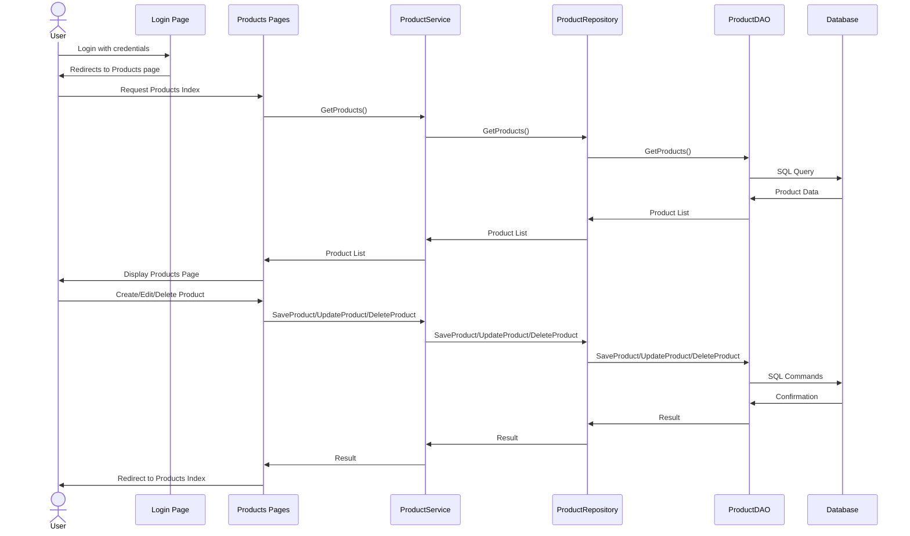

# Product Management System - Razor Pages

A .NET Core Razor Pages application for product management.

## Application Flow



## Project Structure
- **BussiessObjects**: Contains entity models (Product, Category, AccountMember)
- **DataAccessObjects**: Database context and data access layer
- **Repositories**: Repository pattern implementation
- **Services**: Business logic services
- **ProductStore**: Razor Pages web application

## Codebase Structure

```
ProductManagement.RazorPages/
├── BussiessObjects/                    # Business Entity Models
│   ├── BussiessObjects.csproj
│   └── Entities/
│       ├── AccountMember.cs           # User account entity
│       ├── Category.cs                # Product category entity
│       └── Product.cs                 # Product entity
│
├── DataAccessObjects/                  # Data Access Layer
│   ├── DataAccessObjects.csproj
│   ├── MyStoreContext.cs              # Entity Framework DbContext
│   ├── AccountDAO.cs                  # Account data access operations
│   ├── CategoryDAO.cs                 # Category data access operations
│   └── ProductDAO.cs                  # Product data access operations
│
├── Repositories/                       # Repository Pattern Implementation
│   ├── Repositories.csproj
│   ├── IAccountRepository.cs          # Account repository interface
│   ├── AccountRepository.cs           # Account repository implementation
│   ├── ICategoryRepository.cs         # Category repository interface
│   ├── CategoryRepository.cs          # Category repository implementation
│   ├── IProductRepository.cs          # Product repository interface
│   └── ProductRepository.cs           # Product repository implementation
│
├── Services/                          # Business Logic Layer
│   ├── Services.csproj
│   ├── IAccountService.cs             # Account service interface
│   ├── AccountService.cs              # Account business logic
│   ├── ICategoryService.cs            # Category service interface
│   ├── CategoryService.cs             # Category business logic
│   ├── IProductService.cs             # Product service interface
│   └── ProductService.cs              # Product business logic
│
└── ProductStore/                      # Razor Pages Web Application
    ├── ProductStore.csproj
    ├── Program.cs                     # Application entry point
    ├── appsettings.json              # Configuration settings
    ├── appsettings.Development.json  # Development settings
    │
    ├── Models/                       # View Models and DTOs
    │   ├── ErrorViewModel.cs         # Error handling model
    │   ├── LoginDTO.cs               # Login data transfer object
    │   ├── CreateProductDTO.cs       # Product creation DTO
    │   └── UpdateProductDTO.cs       # Product update DTO
    │
    ├── Pages/                        # Razor Pages
    │   ├── _ViewStart.cshtml         # View start configuration
    │   ├── _ViewImports.cshtml       # Global using statements
    │   ├── Index.cshtml              # Home page
    │   ├── Index.cshtml.cs           # Home page model
    │   ├── Login.cshtml              # Login page
    │   ├── Login.cshtml.cs           # Login page model
    │   ├── Privacy.cshtml            # Privacy page
    │   ├── Privacy.cshtml.cs         # Privacy page model
    │   ├── Error.cshtml              # Error page
    │   ├── Error.cshtml.cs           # Error page model
    │   │
    │   ├── Products/                 # Product-related pages
    │   │   ├── Index.cshtml          # Product listing page
    │   │   ├── Index.cshtml.cs       # Product listing page model
    │   │   ├── Create.cshtml         # Product creation page
    │   │   ├── Create.cshtml.cs      # Product creation page model
    │   │   ├── Edit.cshtml           # Product editing page
    │   │   ├── Edit.cshtml.cs        # Product editing page model
    │   │   ├── Details.cshtml        # Product details page
    │   │   ├── Details.cshtml.cs     # Product details page model
    │   │   ├── Delete.cshtml         # Product deletion page
    │   │   └── Delete.cshtml.cs      # Product deletion page model
    │   │
    │   └── Shared/                   # Shared layouts and partials
    │       ├── _Layout.cshtml        # Main layout template
    │       └── _ValidationScriptsPartial.cshtml
    │
    ├── Properties/
    │   └── launchSettings.json       # Launch configuration
    │
    └── wwwroot/                      # Static files (CSS, JS, images)
        ├── css/
        ├── js/
        └── lib/
```

## Running the Project from Command Line

### Prerequisites
- .NET SDK 8.0 or later
- SQL Server with a database named "MyStore"

### Steps to Run the Project

1. **Open Command Prompt**: Open a command prompt window (cmd) or PowerShell.

2. **Navigate to Project Directory**: Navigate to the main project directory:
   ```
   cd d:\ASP\SEM7\.TheRazorRepo\ProductManagement.RazorPages\ProductStore
   ```

3. **Restore Dependencies**: Restore all the NuGet packages:
   ```
   dotnet restore
   ```

4. **Build the Project**:
   ```
   dotnet build
   ```

5. **Run the Application**:
   ```
   dotnet run
   ```

6. **Access the Application**: Once running, the application should be accessible at:
   - https://localhost:5001 
   - http://localhost:5000
   
   (The exact ports may vary based on your configuration)

7. **Login**: The application will start at the login page since the default route is set to the Login page.

### Additional Options

- **Run with specific environment**:
  ```
  dotnet run --environment Development
  ```

- **Run with a specific port**:
  ```
  dotnet run --urls="http://localhost:8080"
  ```

- **Run in Watch mode** (automatically recompiles when code changes):
  ```
  dotnet watch run
  ```

## Key Differences from MVC Version

- **Page-based routing**: Uses Razor Pages with page-based routing instead of controller-based routing
- **Code-behind files**: Each page has an associated `.cshtml.cs` file containing the page model
- **Simplified structure**: Pages are organized in the `/Pages` directory with a more straightforward structure
- **Page handlers**: Uses page handler methods (OnGet, OnPost, etc.) instead of controller actions

## Pages Structure

- **Login.cshtml**: User authentication page
- **Index.cshtml**: Home page
- **Products/**: Directory containing all product-related pages
  - **Index.cshtml**: Product listing page
  - **Create.cshtml**: Product creation page
  - **Edit.cshtml**: Product editing page
  - **Delete.cshtml**: Product deletion confirmation page
  - **Details.cshtml**: Product details page

## Notes
- The application uses Entity Framework Core and expects a SQL Server database called "MyStore" to be available.
- Make sure the connection string in the appsettings.json file is configured correctly for your environment.
- This Razor Pages version follows the same business logic and data access patterns as the MVC version but with a page-centric approach.
